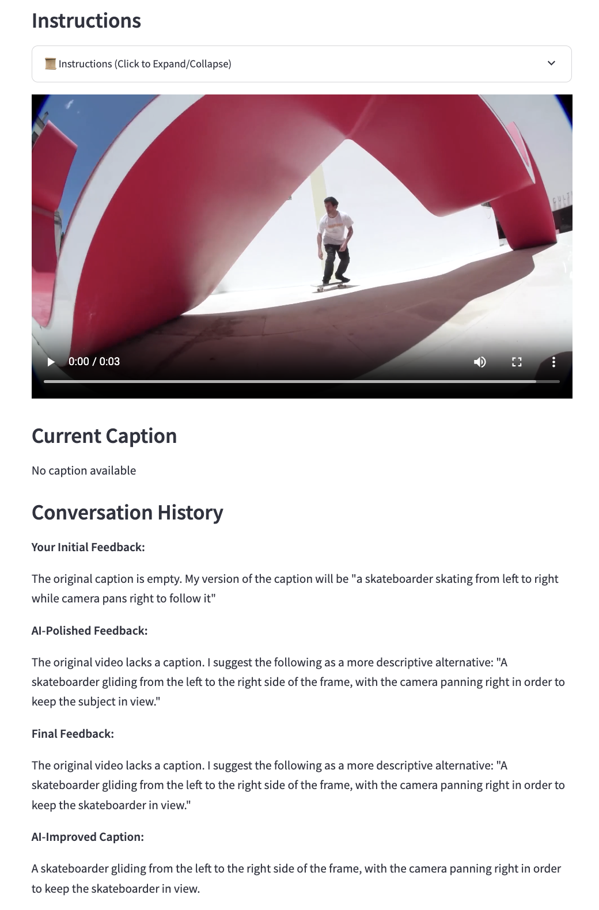

# 📌 Video Caption and Review System

This is a **Streamlit-based web app** for **creating, editing, and reviewing video captions**. It provides a unified portal system that allows users to generate AI-powered pre-captions, provide feedback to refine them, and review caption differences across annotators and reviewers.

## 🚀 Features
- Users review pre-loaded captions for given videos.
- A step-by-step feedback system improves captions iteratively.
- AI-generated suggestions enhance user-provided feedback.
- Users provide ratings at multiple stages to ensure caption quality.

---

<!-- ## 🛠 Installation Guide

### **1️⃣ Install Required Packages**
Ensure **Python 3.8+** is installed, then install the necessary dependencies:
```bash
python3 -m pip install streamlit openai streamlit-feedback
python3 -m pip install torch torchvision torchaudio
python3 -m pip install opencv-python-headless numpy
python3 -m pip install -q -U google-genai
``` -->

### **2️⃣ Clone and Run the Streamlit App**
```bash
python3 -m streamlit run caption/apps/app.py --server.port 5191 --server.address 0.0.0.0
```
The Streamlit app should now be running and accessible in your browser! 🎉

For lighting project configuration:
```bash
python3 -m streamlit run caption/apps/app.py --server.port 5191 --server.address 0.0.0.0 -- --config-type lighting
```

For new annotator training:
```bash
python3 -m streamlit run caption/apps/onboarding_app.py --server.port 5191 --server.address 0.0.0.0
```

---



### **Portal Selection**
After login, users choose between two main portals:

### **📝 Caption Portal**
1️⃣ **Pre-caption Generation**  
- AI generates initial captions using selected models and video frames/content
- Users can modify prompts and regenerate pre-captions as needed

2️⃣ **User Rating and Feedback**  
- Users rate the pre-caption using a **1-5 Likert scale**:
  - **5 (😀 Happiest Face)** → Caption is accepted as final
  - **1-4** → User provides feedback for improvement

3️⃣ **AI-Enhanced Feedback and Caption Generation**  
- User feedback is polished by AI and used to generate improved captions
- Users can edit both feedback and final captions before submission

4️⃣ **Review and Approval**  
- Approved reviewers can approve or reject submitted captions
- Rejected captions can be corrected by the original annotator or reviewer

### **🔍 Review Portal**
- Compare captions between different annotators
- View caption differences and feedback comparisons
- Review accuracy statistics across tasks and annotators
- Examine approved, rejected, and pending captions

---

## 🔧 Configuration
The app uses **configuration files** that specify:
- **Video URLs files** (links to video batches)
- **Video data file** (video metadata and labels)
- **Task configurations** (caption generation prompts and settings)
- **Output directories** for saving annotation data

### Main Project Configuration
Modify `caption/config/main_config.py` to adjust:
- `DEFAULT_VIDEO_URLS_FILES` - list of video batch files
- Video data file path and label collections
- Caption generation policies and prompts

### Lighting Project Configuration  
Modify `caption/config/lighting_config.py` to adjust:
- `LIGHTING_VIDEO_URLS_FILES` - list of lighting video batch files
- Lighting-specific video data and configurations